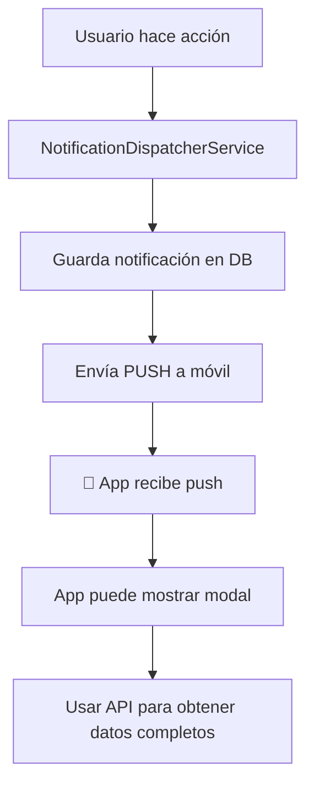

# 📱 API de Notificaciones para App Móvil

## 🎯 Objetivo
Esta documentación explica cómo la app móvil puede obtener y mostrar notificaciones del sistema de tickets tanto como **push notifications** como **modales dentro de la app**.

## 🔄 Flujo General de Notificaciones



---

## 📡 **API Endpoints Disponibles**

### **1. 🔔 Obtener Notificaciones**
```http
GET /api/tenant/notifications
Authorization: Bearer {token}
```

**⚠️ Importante:** 
- Retorna las **50 notificaciones más recientes** (no todas)
- Ordenadas por fecha descendente (más nuevas primero)
- Para obtener más notificaciones, implementar paginación (ver abajo)

**Parámetros opcionales:**
- `?limit=20` - Limitar cantidad (máximo 50)
- `?unread_only=true` - Solo no leídas

**Respuesta:**
```json
{
  "success": true,
  "notifications": [
    {
      "id": "uuid-notification-id",
      "type": "App\\Notifications\\TicketNotification",
      "title": "👨‍🔧 Ticket Assigned",
      "message": "The ticket 'Problema con aire acondicionado' has been assigned to John Doe (Phone: +1234567890) - Device: Samsung Aire Acondicionado Sala at Apto 301, Edificio Central",
      
      // 🎫 TICKET DATA (campos directos como en push notifications)
      "ticket_id": 123,
      "ticket_code": "TCK-00123",
      "ticket_title": "Problema con aire acondicionado",
      "ticket_status": "assigned",
      "ticket_priority": "high",
      
      // 🔧 DEVICE DATA (campos directos, incluye imagen nueva)
      "device_id": 456,
      "device_name": "Aire Acondicionado Sala",
      "device_image": "/storage/name_devices/ac_image.jpg", // ✅ NUEVA IMAGEN
      "device_icon": 1,
      "device_brand": "Samsung",
      "device_model": "WindFree",
      "device_ubicacion": "Sala Principal",
      
      // 👨‍💻 TECHNICAL DATA (campos directos)
      "technical_id": 789,
      "technical_name": "John Doe",
      "technical_phone": "+1234567890",
      "technical_photo": "/storage/technicals/john_photo.jpg",
      
      // 🏠 LOCATION DATA (campos directos)
      "client_name": "María García",
      "client_phone": "+0987654321",
      "building_name": "Edificio Central",
      "apartment_name": "Apto 301",
      
      // 📊 STATUS CHANGE DATA (solo para cambios de estado)
      "old_status": "open",
      "new_status": "assigned",
      "changed_by": "Admin User",
      
      // 🎨 UI DATA
      "priority": "high",
      "notification_type": "ticket_assigned", // Ver tipos abajo
      "icon": "bell",
      "color": "blue",
      
      // 📅 META DATA
      "is_read": false,
      "read_at": null,
      "created_at": "2025-09-28T10:30:00.000Z",
      "updated_at": "2025-09-28T10:30:00.000Z"
    }
  ],
  "unread_count": 3,
  "total_count": 15
}
```

### **2. ✅ Marcar Notificación como Leída**
```http
POST /api/tenant/notifications/{notification_id}/read
Authorization: Bearer {token}
```

### **3. ✅ Marcar Todas como Leídas**
```http
POST /api/tenant/notifications/mark-all-read
Authorization: Bearer {token}
```

### **4. 📄 Paginación (Para implementar si necesitas más de 50)**
```http
GET /api/tenant/notifications?offset=50&limit=25
Authorization: Bearer {token}
```

**Nota:** La paginación no está implementada actualmente. Si necesitas más de 50 notificaciones, contacta al backend para implementar paginación.

---

## 💡 **Mejores Prácticas para la App**

### **🎯 Para Modales en Tiempo Real:**
1. **Usar polling cada 30-60 segundos** para verificar notificaciones nuevas
2. **Filtrar por timestamp** - Solo mostrar modal si la notificación es de los últimos 2-5 minutos
3. **Evitar spam** - No mostrar modal si ya hay uno abierto

### **📱 Para Lista de Notificaciones:**
1. **Cache local** - Guardar las 50 notificaciones en el dispositivo
2. **Pull to refresh** - Actualizar al hacer swipe down
3. **Marcar como leída** al abrir el modal o navegar al ticket

```javascript
// Ejemplo de implementación óptima
class NotificationManager {
    constructor() {
        this.lastCheck = null;
        this.modalOpen = false;
    }
    
    async checkForNewNotifications() {
        const notifications = await fetchNotifications();
        
        // Solo notificaciones de los últimos 2 minutos
        const veryRecent = notifications.filter(n => 
            !n.is_read && 
            isWithinLastMinutes(n.created_at, 2)
        );
        
        // No mostrar modal si ya hay uno abierto
        if (veryRecent.length > 0 && !this.modalOpen) {
            this.showModal(veryRecent[0]);
        }
    }
    
    showModal(notification) {
        this.modalOpen = true;
        // ... mostrar modal
    }
    
    dismissModal() {
        this.modalOpen = false;
    }
}
```

---

## 🔔 **Tipos de Notificaciones**

| Tipo | `notification_type` | Cuándo ocurre | Datos especiales |
|------|-------------------|---------------|------------------|
| **Ticket Asignado** | `ticket_assigned` | Se asigna técnico | `technical_*` fields |
| **Cambio de Estado** | `ticket_status_changed` | Status cambia | `old_status`, `new_status` |
| **Ticket Creado** | `ticket_created` | Nuevo ticket | `created_by` |
| **Comentario Agregado** | `ticket_comment` | Nuevo comentario | `comment`, `comment_by` |
| **Cita Creada** | `appointment_created` | Nueva cita | `appointment_*` fields |
| **Cita Iniciada** | `appointment_started` | Cita comienza | `appointment_*` fields |
| **Cita Completada** | `appointment_completed` | Cita termina | `completion_notes` |
| **Ticket Resuelto** | `ticket_resolved` | Ticket resuelto | `technical_photo` |

---

## 🎨 **Implementación en la App Móvil**

### **� Problema: Push Notifications solo funcionan cuando la app está cerrada**

❌ **Push Notifications**: Solo llegan cuando la app está en background/cerrada  
✅ **Solución**: Combinar push + polling/WebSocket para app abierta

### **1. 📱 Estrategia Híbrida: Push + Polling**

```javascript
// services/NotificationService.js
class NotificationService {
    constructor(apiService) {
        this.apiService = apiService;
        this.isAppActive = true;
        this.lastNotificationCheck = null;
        this.pollingInterval = null;
        this.modalOpen = false;
    }
    
    // 🔔 Setup completo para app abierta Y cerrada
    setupNotifications() {
        // 1. Push notifications para app cerrada/background
        this.setupPushNotifications();
        
        // 2. Polling para app abierta
        this.startPollingWhenAppActive();
        
        // 3. Detectar cuando app cambia de estado
        this.setupAppStateListener();
    }
    
    // � Polling para cuando la app está ABIERTA
    startPollingWhenAppActive() {
        if (this.pollingInterval) return;
        
        this.pollingInterval = setInterval(async () => {
            if (this.isAppActive && !this.modalOpen) {
                await this.checkForNewNotifications();
            }
        }, 10000); // Cada 10 segundos cuando app está abierta
    }
    
    // 🔍 Verificar notificaciones nuevas
    async checkForNewNotifications() {
        try {
            const response = await this.apiService.get('/tenant/notifications?limit=5');
            const notifications = response.data.notifications;
            
            // Buscar notificaciones muy recientes (últimos 30 segundos)
            const veryRecent = notifications.filter(notification => {
                const notificationTime = new Date(notification.created_at);
                const now = new Date();
                const diffMs = now - notificationTime;
                
                // Solo últimos 30 segundos Y no leídas
                return diffMs <= 30000 && !notification.is_read;
            });
            
            if (veryRecent.length > 0) {
                const latestNotification = veryRecent[0];
                this.showModalFromAPIData(latestNotification);
            }
            
        } catch (error) {
            console.error('❌ Error checking notifications:', error);
        }
    }
    
    // 🎯 Mostrar modal con datos de la API
    showModalFromAPIData(notification) {
        if (this.modalOpen) return;
        
        this.modalOpen = true;
        
        const modalData = {
            // Los datos están disponibles directamente (no en objetos anidados)
            ticketId: notification.ticket_id,
            ticketCode: notification.ticket_code,
            ticketTitle: notification.ticket_title,
            
            // Device data (con nueva imagen) - campos directos
            deviceName: notification.device_name,
            deviceImage: notification.device_image, // ✅ Nueva imagen disponible
            deviceBrand: notification.device_brand,
            deviceUbicacion: notification.device_ubicacion,
            
            // Technical data - campos directos
            technicalName: notification.technical_name,
            technicalPhone: notification.technical_phone,
            technicalPhoto: notification.technical_photo,
            
            // Client/Location data - campos directos
            clientName: notification.client_name,
            clientPhone: notification.client_phone,
            apartmentName: notification.apartment_name,
            buildingName: notification.building_name,
            
            // Notification data
            message: notification.message,
            notificationType: notification.notification_type,
            priority: notification.priority
        };
        
        // Mostrar modal específico según el tipo
        this.showModalByType(modalData);
        
        // Marcar como leída automáticamente
        this.markAsRead(notification.id);
    }
    
    // 📱 Push notifications para app cerrada
    setupPushNotifications() {
        // Cuando la app se ABRE desde una push notification
        Notifications.addNotificationResponseReceivedListener(response => {
            console.log('👆 App opened from push notification');
            
            const pushData = response.notification.request.content.data;
            
            // Los datos del push vienen directamente en pushData (no objetos anidados)
            this.showModalFromPushData(pushData);
        });
    }
    
    // 🔄 Detectar estado de la app
    setupAppStateListener() {
        AppState.addEventListener('change', (nextAppState) => {
            this.isAppActive = nextAppState === 'active';
            
            console.log(`📱 App state: ${nextAppState}`);
            
            if (nextAppState === 'active') {
                // App volvió a primer plano - verificar notificaciones inmediatamente
                setTimeout(() => {
                    this.checkForNewNotifications();
                }, 1000);
            }
        });
    }
    
    // 🎨 Mostrar modal según el tipo
    showModalByType(data) {
        switch (data.notificationType) {
            case 'ticket_assigned':
                this.showTicketAssignedModal(data);
                break;
            case 'ticket_status_changed':
                this.showStatusChangeModal(data);
                break;
            case 'appointment_created':
                this.showAppointmentModal(data);
                break;
            default:
                this.showGenericModal(data);
        }
    }
    
    showTicketAssignedModal(data) {
        Alert.alert(
            "✅ Técnico Asignado",
            `${data.technicalName} fue asignado a "${data.ticketTitle}"`,
            [
                { 
                    text: "Ver Ticket", 
                    onPress: () => {
                        this.dismissModal();
                        this.navigateToTicket(data.ticketId);
                    }
                },
                {
                    text: "Llamar",
                    onPress: () => {
                        this.dismissModal();
                        this.callTechnical(data.technicalPhone);
                    }
                },
                { 
                    text: "Cerrar", 
                    style: "cancel",
                    onPress: () => this.dismissModal()
                }
            ]
        );
    }
    
    showStatusChangeModal(data) {
        Alert.alert(
            "🔄 Estado Actualizado",
            `"${data.ticketTitle}" - Nuevo estado: ${data.newStatus}`,
            [
                { 
                    text: "Ver Ticket", 
                    onPress: () => {
                        this.dismissModal();
                        this.navigateToTicket(data.ticketId);
                    }
                },
                { 
                    text: "Cerrar", 
                    style: "cancel",
                    onPress: () => this.dismissModal()
                }
            ]
        );
    }
    
    dismissModal() {
        this.modalOpen = false;
    }
    
    // ✅ Marcar como leída
    async markAsRead(notificationId) {
        try {
            await this.apiService.post(`/tenant/notifications/${notificationId}/read`);
        } catch (error) {
            console.error('Error marking as read:', error);
        }
    }
    
    // 🧭 Navegación
    navigateToTicket(ticketId) {
        // Tu lógica de navegación
        navigation.navigate('TicketDetail', { ticketId });
    }
    
    callTechnical(phone) {
        if (phone) {
            Linking.openURL(`tel:${phone}`);
        }
    }
    
    // 🧹 Cleanup
    cleanup() {
        if (this.pollingInterval) {
            clearInterval(this.pollingInterval);
        }
    }
}

// Singleton
export const notificationService = new NotificationService(apiService);
```

### **2. � Uso en la App**

```javascript
// App.js
import { notificationService } from './services/NotificationService';

export default function App() {
    useEffect(() => {
        // Inicializar servicio híbrido
        notificationService.setupNotifications();
        
        // Cleanup
        return () => {
            notificationService.cleanup();
        };
    }, []);

    return (
        <NavigationContainer>
            {/* Tu navegación */}
        </NavigationContainer>
    );
}
```

### **2. 🔔 Polling para Nuevas Notificaciones**

```javascript
// Verificar cada 30 segundos si hay notificaciones nuevas
setInterval(async () => {
    const notifications = await fetchNotifications();
    const unreadRecent = notifications.filter(n => 
        !n.is_read && 
        isWithinLast5Minutes(n.created_at)
    );
    
    if (unreadRecent.length > 0) {
        showNotificationModal(unreadRecent[0]);
    }
}, 30000);

function isWithinLast5Minutes(timestamp) {
    const now = new Date();
    const notificationTime = new Date(timestamp);
    const diffMs = now - notificationTime;
    return diffMs <= 5 * 60 * 1000; // 5 minutos
}
```

### **3. 🎨 Ejemplos de Modales por Tipo**

#### **Modal para Ticket Asignado:**
```javascript
function showTicketAssignedModal(notification) {
    const modalData = {
        title: "Técnico Asignado ✅",
        message: `${notification.technical_name} fue asignado a tu ticket`,
        ticketCode: notification.ticket_code,
        ticketTitle: notification.ticket_title,
        deviceName: notification.device_name,
        deviceImage: notification.device_image, // ✅ Usar nueva imagen
        technicalName: notification.technical_name,
        technicalPhoto: notification.technical_photo,
        technicalPhone: notification.technical_phone,
        priority: notification.priority,
        actions: [
            { text: "Ver Ticket", action: () => navigateToTicket(notification.ticket_id) },
            { text: "Contactar", action: () => callTechnical(notification.technical_phone) },
            { text: "Cerrar", action: () => dismissModal() }
        ]
    };
    
    showModal(modalData);
}
```

#### **Modal para Cambio de Estado:**
```javascript
function showStatusChangeModal(notification) {
    const statusEmojis = {
        'open': '🔓',
        'assigned': '👨‍💻', 
        'in_progress': '⚡',
        'resolved': '✅',
        'closed': '🔒'
    };
    
    const modalData = {
        title: `Estado Actualizado ${statusEmojis[notification.new_status]}`,
        message: `Tu ticket cambió de "${notification.old_status}" a "${notification.new_status}"`,
        ticketCode: notification.ticket_code,
        deviceName: notification.device_name,
        deviceImage: notification.device_image,
        changedBy: notification.changed_by,
        actions: [
            { text: "Ver Detalles", action: () => navigateToTicket(notification.ticket_id) },
            { text: "Cerrar", action: () => dismissModal() }
        ]
    };
    
    showModal(modalData);
}
```

---

## 🚀 **Estrategias de Implementación**

### **✅ Estrategia Híbrida: Push + Polling (RECOMENDADO)**

#### **📱 App Cerrada/Background:**
- ✅ **Push Notifications** funcionan perfectamente
- ✅ Usuario recibe notificación del sistema
- ✅ Al abrir app → mostrar modal con datos del push

#### **📲 App Abierta:**
- ❌ **Push Notifications NO LLEGAN** 
- ✅ **Polling cada 10-30 segundos** a `/api/tenant/notifications`
- ✅ Detectar notificaciones de últimos 30 segundos
- ✅ Mostrar modal automáticamente con datos de la API

#### **Flujo Completo:**
```
📱 App CERRADA → Push llega → Usuario abre app → Modal con datos del push
📱 App ABIERTA → Polling API → Detecta nueva notificación → Modal con datos API
```

### **🔧 Implementación Técnica:**

```javascript
// Estrategia híbrida
class NotificationStrategy {
    setupHybridNotifications() {
        // 1. Para app cerrada/background
        this.setupPushNotifications();
        
        // 2. Para app abierta  
        this.startPolling();
        
        // 3. Detector de estado de app
        this.detectAppState();
    }
    
    setupPushNotifications() {
        // Solo funciona cuando app está cerrada
        Notifications.addNotificationResponseReceivedListener(response => {
            // Usuario tocó la notificación → app se abre
            const pushData = response.notification.request.content.data;
            this.showModal(pushData); // Datos completos del push
        });
    }
    
    startPolling() {
        // Solo cuando app está abierta
        setInterval(async () => {
            if (this.isAppActive) {
                const notifications = await this.checkAPI();
                const recent = this.filterRecentNotifications(notifications);
                
                if (recent.length > 0) {
                    this.showModal(recent[0]); // Datos de la API
                }
            }
        }, 15000); // Cada 15 segundos
    }
}
```

---

### **❌ Estrategias NO Recomendadas:**

#### **Solo Push Notifications:**
- ❌ No funciona cuando app está abierta
- ❌ Usuario pierde notificaciones en tiempo real

#### **Solo Polling:**
- ❌ No funciona cuando app está cerrada
- ❌ Alto consumo de batería
- ❌ Retraso en las notificaciones

#### **WebSocket:**
- ✅ Sería ideal para tiempo real
- ❌ Complejo de implementar
- ❌ Requiere cambios en el backend

---

## 🔧 **Datos Importantes**

### **URLs de Imágenes:**
- **Device Images**: `https://tu-dominio.com/storage/{device_image}`
- **Technical Photos**: `https://tu-dominio.com/storage/{technical_photo}`
- **Building Photos**: `https://tu-dominio.com/storage/{building_photo}`

### **Estados de Ticket:**
- `open` - Abierto
- `assigned` - Asignado  
- `in_progress` - En progreso
- `resolved` - Resuelto
- `closed` - Cerrado
- `cancelled` - Cancelado

### **Prioridades:**
- `low` - Baja
- `medium` - Media
- `high` - Alta
- `urgent` - Urgente

---

## 📋 **Checklist para el Desarrollador Móvil**

### **🎯 Implementación Inmediata (Push → Modal):**
- [ ] ✅ **Ya tienes push notifications funcionando** (de los otros READMEs)
- [ ] � **Agregar listener de push** que muestre modal automáticamente
- [ ] 🎨 **Crear modales específicos** para cada `notification_type`
- [ ] 🖼️ **Usar `device_image`** en los modales (nueva imagen del NameDevice)
- [ ] 📞 **Botones de acción** (Ver Ticket, Llamar Técnico, etc.)
- [ ] 🧪 **Testear con notificaciones reales** del backend

### **🔧 Implementación Opcional (APIs):**
- [ ] 📱 Implementar fetch de lista de notificaciones (`/api/tenant/notifications`)
- [ ] ✅ Implementar marcar como leído
- [ ] 🎯 Navegación desde modal a pantalla específica
- [ ] 🎨 Personalizar UI según priority y type

---

## ⚡ **Implementación Rápida - Solo lo Esencial**

Si quieres implementar **solo lo básico** para que funcione inmediatamente:

```javascript
// 1️⃣ En tu PushNotificationService existente, agrega:
Notifications.addNotificationReceivedListener(notification => {
    const data = notification.request.content.data;
    
    // Modal básico con datos del push (campos directos)
    Alert.alert(
        data.notification_type === 'ticket_assigned' ? '✅ Técnico Asignado' : '🔔 Notificación',
        data.body || data.message,
        [
            { text: 'Ver', onPress: () => navigateToTicket(data.ticket_id) },
            { text: 'Cerrar', style: 'cancel' }
        ]
    );
});

// 2️⃣ Para navegar al ticket:
function navigateToTicket(ticketId) {
    // Tu navegación existente
    navigation.navigate('TicketDetail', { ticketId });
}
```

**🎉 ¡Con esos 10 líneas ya tienes modales automáticos funcionando!**

### **🚀 Implementación Avanzada - Modal Completo**

Si quieres modales más elaborados con toda la información:

```javascript
// Modal personalizado con toda la data del push (campos directos)
function showAdvancedModal(pushData) {
    const modalContent = (
        <View style={styles.modalContent}>
            {/* Imagen del device - campo directo */}
            {pushData.device_image && (
                <Image 
                    source={{ uri: `${API_BASE_URL}${pushData.device_image}` }}
                    style={styles.deviceImage}
                />
            )}
            
            {/* Info del ticket - campos directos */}
            <Text style={styles.title}>{pushData.ticket_title}</Text>
            <Text style={styles.code}>#{pushData.ticket_code}</Text>
            
            {/* Info del device - campos directos */}
            <Text style={styles.device}>
                📱 {pushData.device_name} ({pushData.device_brand})
            </Text>
            <Text style={styles.location}>
                📍 {pushData.device_ubicacion}
            </Text>
            
            {/* Info del técnico - campos directos */}
            {pushData.technical_name && (
                <View style={styles.technicalInfo}>
                    <Text>👨‍🔧 {pushData.technical_name}</Text>
                    {pushData.technical_phone && (
                        <Text>📞 {pushData.technical_phone}</Text>
                    )}
                </View>
            )}
            
            {/* Info de ubicación - campos directos */}
            {pushData.apartment_name && pushData.building_name && (
                <Text style={styles.locationInfo}>
                    🏢 {pushData.apartment_name}, {pushData.building_name}
                </Text>
            )}
            
            {/* Botones */}
            <View style={styles.actions}>
                <Button 
                    title="Ver Ticket" 
                    onPress={() => navigateToTicket(pushData.ticket_id)} 
                />
                {pushData.technical_phone && (
                    <Button 
                        title="Llamar" 
                        onPress={() => callTechnical(pushData.technical_phone)} 
                    />
                )}
            </View>
        </View>
    );
    
    // Mostrar tu modal personalizado
    showCustomModal(modalContent);
}
```

---

## 🆘 **Soporte**

Para dudas sobre la API o datos faltantes, contacta al equipo backend. 

**Nota:** Todos los campos de `device_image` incluyen la nueva imagen del NameDevice que se agregó recientemente al sistema.

---

## 📋 **Checklist para el Desarrollador Móvil**

### **🎯 Implementación Híbrida (Push + Polling):**
- [ ] ✅ **Push notifications funcionando** para app cerrada (ya tienes esto)
- [ ] 🔔 **Polling cada 15-30 segundos** cuando app está abierta
- [ ] 🎯 **Filtrar notificaciones recientes** (últimos 30 segundos)
- [ ] 🎨 **Modal automático** cuando detecta nuevas notificaciones  
- [ ] 📱 **Detectar estado de app** (abierta vs cerrada)
- [ ] 🖼️ **Usar `device_image`** en los modales (nueva imagen)
- [ ] ✅ **Marcar como leída** automáticamente

### **🔧 APIs Necesarias:**
- [ ] 📡 `GET /api/tenant/notifications?limit=5` - Para polling
- [ ] ✅ `POST /api/tenant/notifications/{id}/read` - Marcar como leída

---

## ⚡ **Implementación Rápida - Híbrida**

### **1️⃣ Para App CERRADA (ya tienes esto):**
```javascript
// Push notifications - cuando usuario abre app desde notificación
Notifications.addNotificationResponseReceivedListener(response => {
    const pushData = response.notification.request.content.data;
    showModalWithPushData(pushData);
});
```

### **2️⃣ Para App ABIERTA (nuevo):**
```javascript
// Polling cuando app está activa
const startNotificationPolling = () => {
    setInterval(async () => {
        if (AppState.currentState === 'active') {
            const response = await fetch('/api/tenant/notifications?limit=5');
            const data = await response.json();
            
            // Buscar notificaciones MUY recientes
            const recent = data.notifications.filter(n => {
                const diffMs = Date.now() - new Date(n.created_at).getTime();
                return diffMs <= 30000 && !n.is_read; // Últimos 30 segundos
            });
            
            if (recent.length > 0) {
                showModalWithAPIData(recent[0]);
                markAsRead(recent[0].id);
            }
        }
    }, 15000); // Cada 15 segundos
};
```

### **3️⃣ Modal Universal:**
```javascript
function showModalWithAPIData(apiData) {
    Alert.alert(
        getModalTitle(apiData.notification_type),
        apiData.message,
        [
            { text: 'Ver', onPress: () => navigateToTicket(apiData.ticket_id) },
            { text: 'Cerrar', style: 'cancel' }
        ]
    );
}

function getModalTitle(type) {
    const titles = {
        'ticket_assigned': '✅ Técnico Asignado',
        'ticket_status_changed': '🔄 Estado Actualizado',
        'appointment_created': '📅 Nueva Cita'
    };
    return titles[type] || '🔔 Notificación';
}
```

**🎉 ¡Con esto tienes cobertura COMPLETA!**
- ✅ App cerrada → Push notifications  
- ✅ App abierta → Polling + modal automático